<!-- SPDX-FileCopyrightText: Copyright (c) 2025 NVIDIA CORPORATION & AFFILIATES. -->
<!-- SPDX-License-Identifier: Apache-2.0 -->

# Getting Started with Cosmos-Reason2 Web UI

This guide walks you through accessing and using the Cosmos-Reason2 inference web UI on the DGX Spark machine.

## 1. Connect to DGX Spark

SSH into the machine (get the IP from the Slack channel):

```bash
# From your local terminal
ssh <get_IP_from_slack_channel>
```

> **AnyDesk** also works for desktop access, but SSH is all you need.

## 2. Start the Services

On the **DGX Spark terminal** (via SSH):

```bash
cd ~/cosmos-reason2
source ~/.env_keys   # loads HF_TOKEN and other credentials
just deploy -d
```

This starts two Docker containers:
- **vllm**: GPU-powered model server (takes ~3-5 minutes to load weights on first run)
- **web**: Browser UI + API on port 9900

Check status:

```bash
docker compose ps
# Wait until vllm shows "healthy"
docker compose logs -f vllm  # watch model loading progress
```

## 3. Open the UI in Your Browser

On your **local machine** terminal, set up an SSH tunnel so you can access the remote UI locally:

```bash
# Local terminal — forwards DGX port 9900 to your laptop
ssh -fNL 9900:localhost:9900 <get_IP_from_slack_channel>
```

Then open your browser to: **http://localhost:9900/interview**

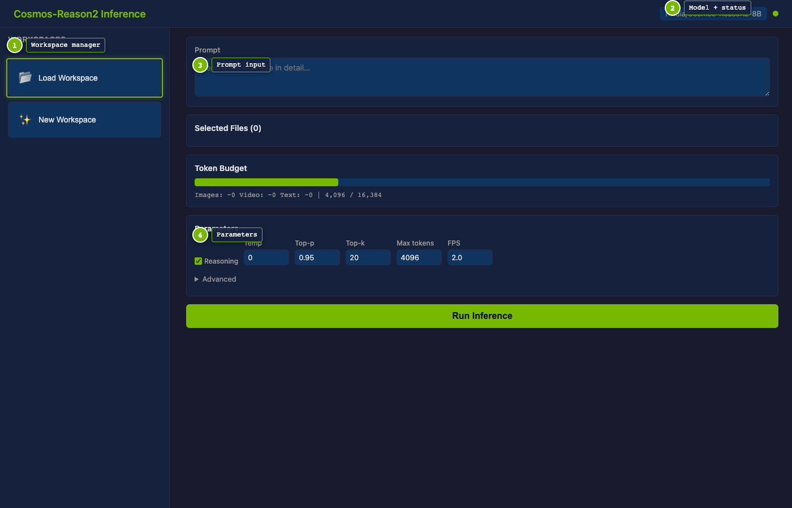

The landing page shows the workspace manager (left sidebar), model badge, and health status indicator.

## 4. Load or Create a Workspace

Click **Load Workspace** to see saved workspaces, then click one to open it.

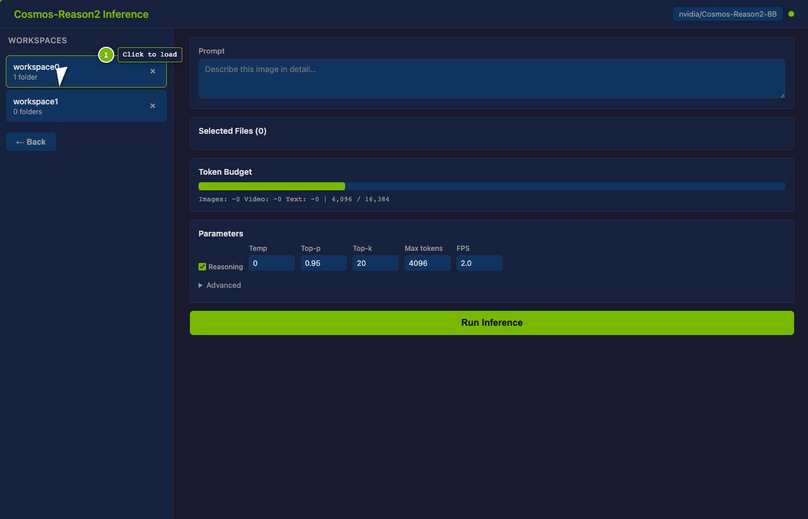

A **workspace** groups folders from different locations on the machine. This is especially useful when your data is spread across directories — for example, raw video snippets in one folder and segmentation masks in a different folder located somewhere else on the computer. You can add both folders to a single workspace and save it. For prompts that need both mask and raw snippets together, the workspace structure is super convenient for repetitive querying — load once, query many times.

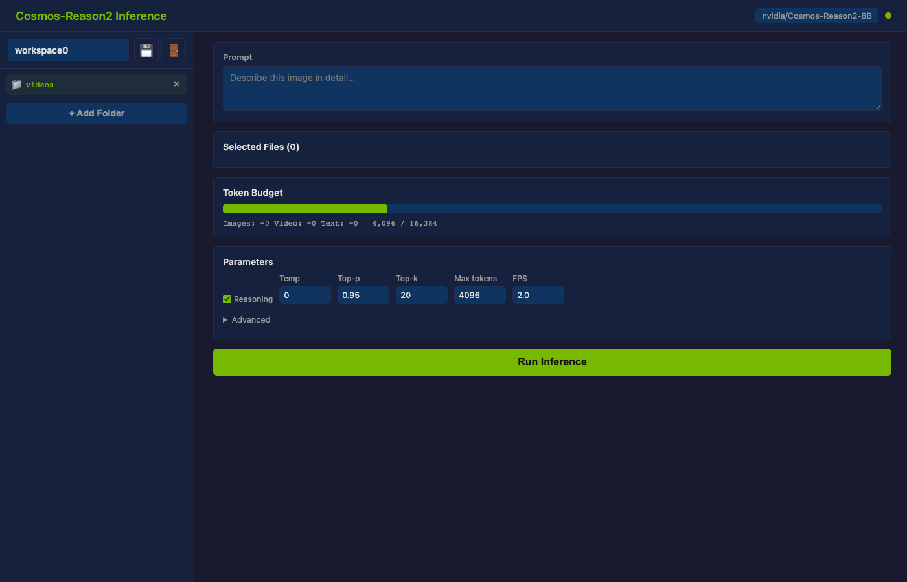

To add more folders, click **+ Add Folder** and navigate the file system.

## 5. Browse the Folder Picker

The folder picker shows a summary of each directory's contents — how many subfolders, images, and videos it contains. This helps you quickly find the right folder to add.

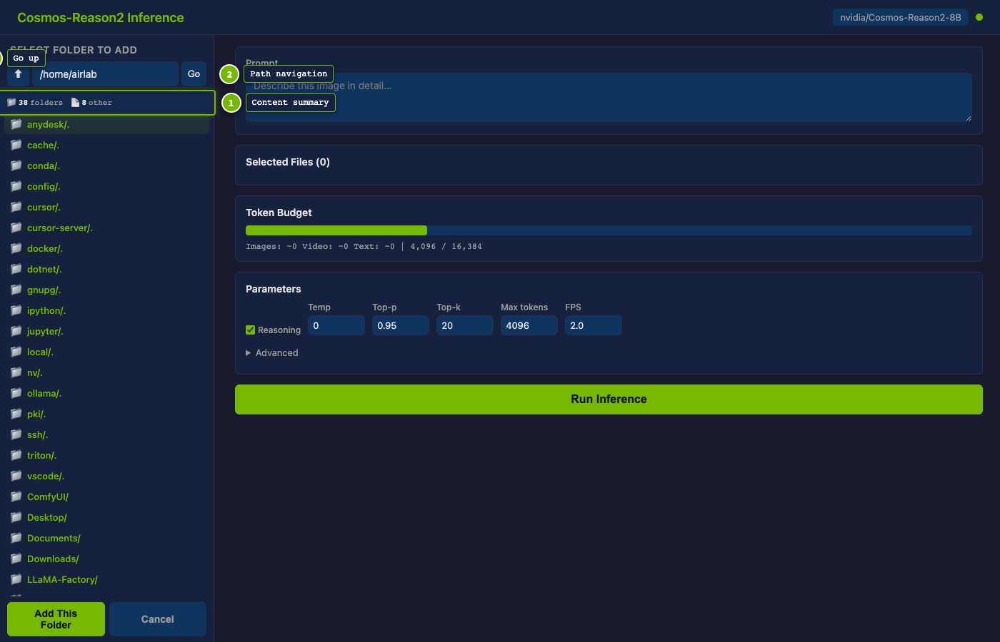

Navigate into a folder to see its files as dimmed context. Directories remain clickable for navigation.

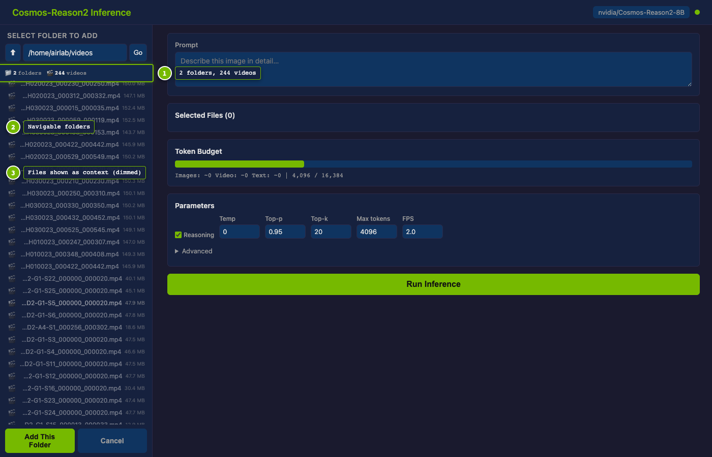

> **Tip**: The `videos/` folder on DGX Spark already has sample `.mp4` files you can test with immediately.

## 6. Select Files for Inference

Click a folder name in the sidebar to open its **file browser**. Check the boxes next to files you want, then click **Add Selected**.

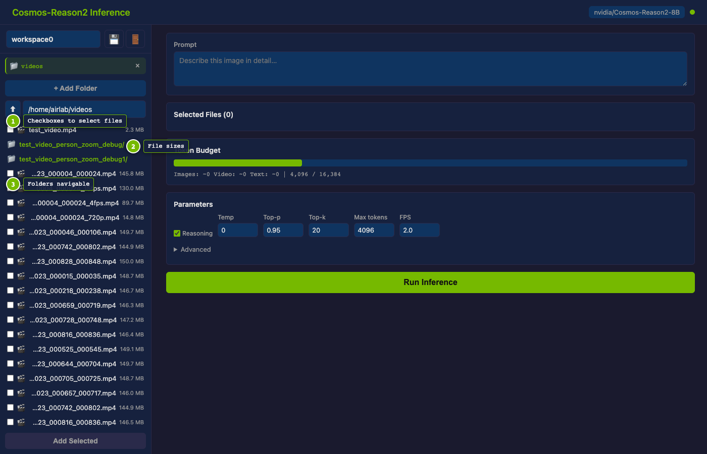

Selected files appear in the main panel with per-file token estimates. The **Token Budget** bar shows how much context you're using.

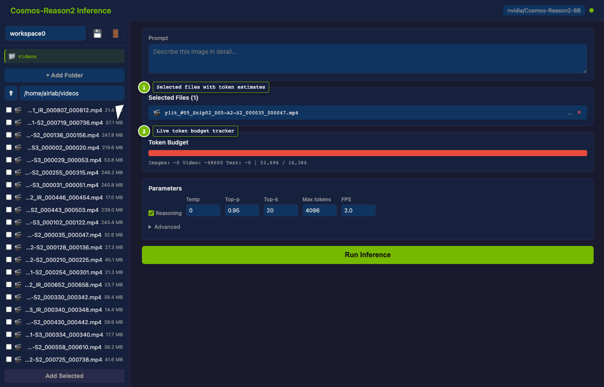

> **Token budget** updates live as you add/remove files or change the prompt. Watch the bar color:
> green (< 70%), yellow (70-90%), red (> 90% — you may need to reduce files or lower max tokens).

### Preview Media for Verification

Click the **filename** of any selected file to open a **Media Preview** panel on the right:

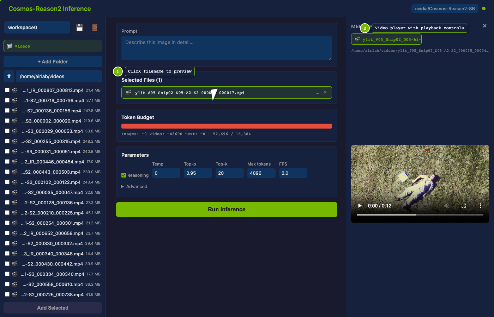

The preview lets you play videos or inspect images at full size — directly in the browser. This is especially useful **after you get a response**: re-watch the clip side-by-side with the model's answer to verify whether the description matches what actually happens in the footage. If the model mentions something you don't see, or misses a key detail, you'll catch it immediately.

> **Tip:** The preview panel stays open while you scroll through the response and reasoning sections below, so you can cross-reference as you read.

## 7. Configure Parameters

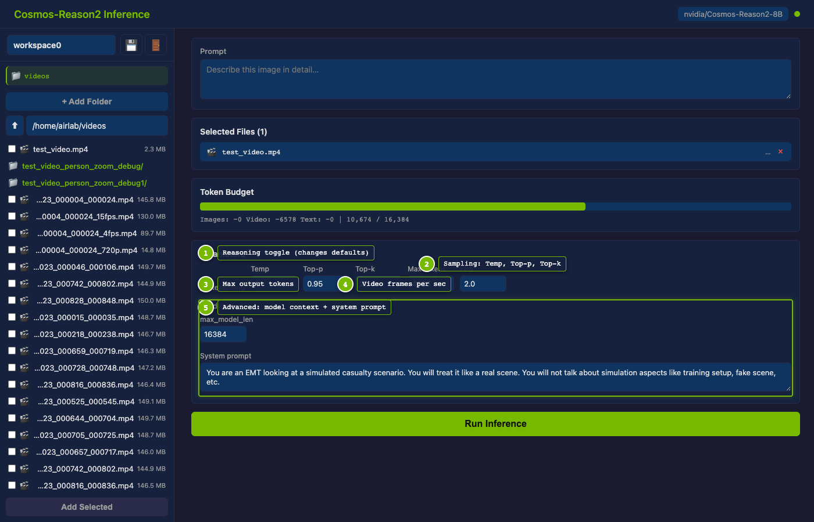

| Parameter | What it does | Default (Reasoning ON) |
|-----------|-------------|----------------------|
| **Reasoning** | Enables chain-of-thought before the final answer | ON |
| **Temp** | Randomness (0 = deterministic) | 0.6 |
| **Top-p** | Nucleus sampling threshold | 0.95 |
| **Top-k** | Top-k sampling | 20 |
| **Max tokens** | Maximum output length | 4096 |
| **FPS** | Video frame sampling rate | 2.0 |

**Advanced** (click to expand):
- **max_model_len**: Total context window (default 16384)
- **System prompt**: Override the default system instruction

## 8. Run Inference

Type your prompt and click **Run Inference**. For example:

> *"Assess the subject casualty around whom the camera will eventually center around for their physiological signatures."*

Results appear below with token usage and timing.

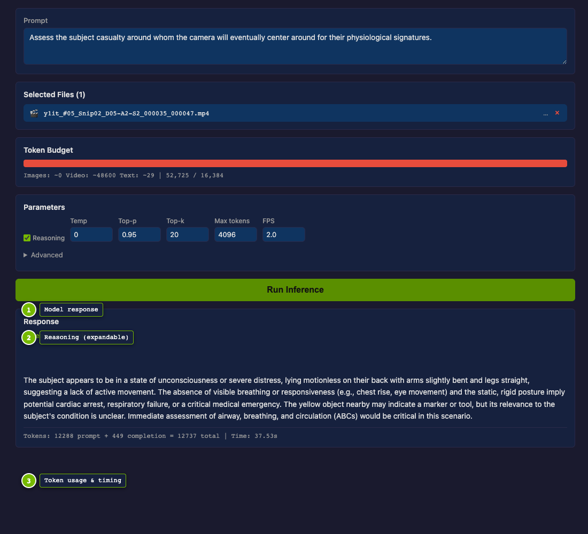

Click **Reasoning (click to expand)** to see the model's chain of thought:

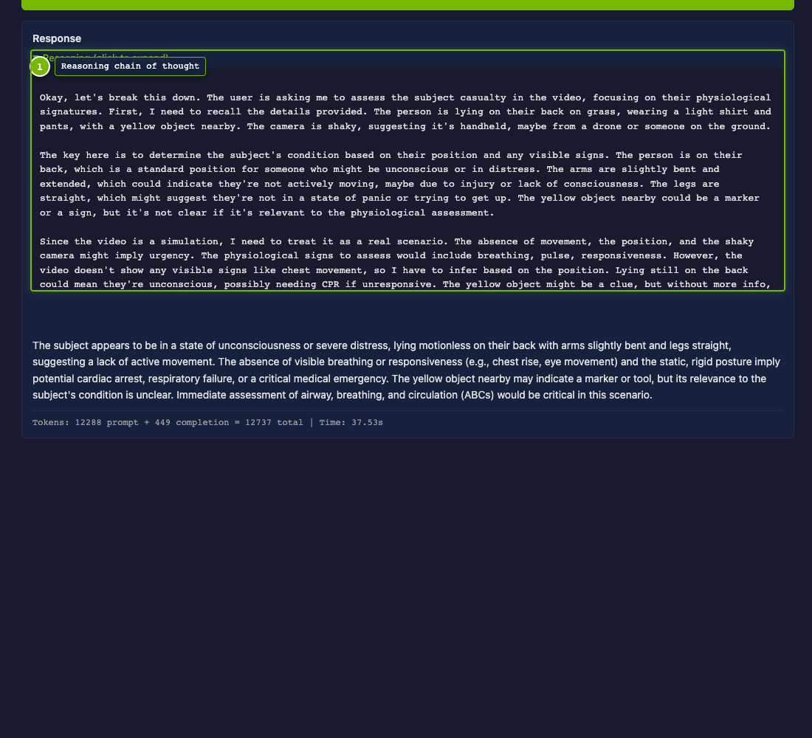

## 9. Upload Your Own Files

To test with your own videos or images, use `rsync` or `scp` from your **local terminal**:

```bash
# Copy a video from your laptop to DGX Spark
scp my_video.mp4 <get_IP_from_slack_channel>:~/my_data/

# Or sync a whole folder
rsync -avz ./my_folder/ <get_IP_from_slack_channel>:~/my_data/
```

Then in the UI, click **+ Add Folder** and navigate to your upload location (e.g., `/home/airlab/my_data`).

## Quick Reference

| Action | Where to type | Command |
|--------|--------------|---------|
| SSH to DGX | Local terminal | `ssh <IP>` |
| Start services | DGX terminal | `cd ~/cosmos-reason2 && source ~/.env_keys && just deploy -d` |
| SSH tunnel | Local terminal | `ssh -fNL 9900:localhost:9900 <IP>` |
| Open UI | Local browser | `http://localhost:9900/interview` |
| Check health | Local browser or curl | `curl localhost:9900/api/health` |
| Upload files | Local terminal | `scp file.mp4 <IP>:~/my_data/` |
| Stop services | DGX terminal | `docker compose down` |
